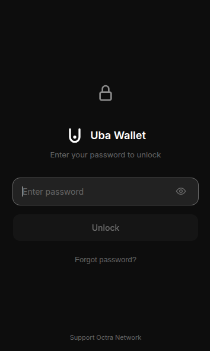
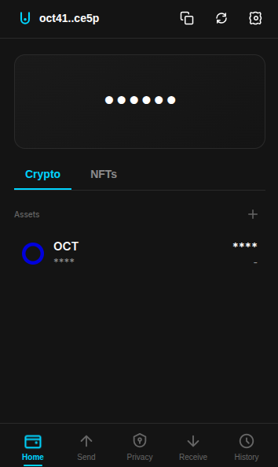
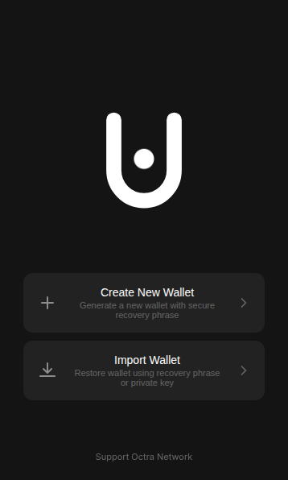

# Octra Wallet - Browser Extension

## Overview
Octra Wallet is a secure, non-custodial cryptocurrency wallet extension for the Octra Network. It is designed to run as a browser extension (Chrome, Edge, Firefox, Brave) to provide a seamless and secure experience for managing your Octra assets.

## Features
- **Non-Custodial**: You own your keys. Your private keys never leave your device.
- **Secure Storage**: Advanced client-side encryption (AES-256-GCM) protecting your wallet data.
- **Privacy First**: No tracking, no analytics, no external data collection. Direct communication with Octra RPC nodes.
- **Full Functionality**: Send and receive OCTOR, view transaction history, and manage multiple wallets.
- **Modern UI**: Clean, responsive, and intuitive interface with dark mode support.

## Installation (Developer Mode)

Since this is a browser extension, you cannot "run" it like a standard website. You must install it into your browser.

### 1. Build the Extension
First, you need to build the project from source.

**Prerequisites:**
- Node.js (v18+)
- npm (v9+)

**Steps:**
1.  Clone the repository:
    ```bash
    git clone https://github.com/irhamuba/octra-wallet.git
    cd octra-wallet
    ```
2.  Install dependencies:
    ```bash
    npm install
    ```
3.  Build the project:
    ```bash
    npm run build
    ```
    This will create a `dist/` folder containing the compiled extension.

### 2. Load into Browser

#### Chrome / Brave / Edge
1.  Open your browser and navigate to the Extensions management page:
    - Chrome: `chrome://extensions`
    - Edge: `edge://extensions`
    - Brave: `brave://extensions`
2.  Enable **Developer mode** (usually a toggle in the top-right corner).
3.  Click **Load unpacked**.
4.  Select the `dist` folder generated in the build step.
5.  The Octra Wallet extension should now appear in your browser toolbar.

#### Firefox
1.  Open Firefox and navigate to `about:debugging#/runtime/this-firefox`.
2.  Click **Load Temporary Add-on...**.
3.  Navigate to the `dist` folder and select the `manifest.json` file.
4.  The extension will be installed temporarily (until you restart Firefox).

## Usage Guide

1.  **Open the Wallet**: Click the Octra icon in your browser toolbar to open the popup.
2.  **Create or Import**:
    - **Create New Wallet**: Follow the prompts to generate a new seed phrase. **Write this down safely!**
    - **Import Wallet**: Use an existing seed phrase or private key to restore your wallet.
3.  **Dashboard**:
    - View your balance in OCTOR.
    - Copy your wallet address.
    - Switch between different wallets if you have multiple.
4.  **Send**: Click "Send", enter the recipient address and amount. Confirm the transaction details before signing.
5.  **Receive**: Click "Receive" to show your QR code and public address.
6.  **Settings**: access security settings, manage networks (RPC), and export keys.

## Development

If you are developing or contributing to the code:

-   **Development Server**:
    ```bash
    npm run dev
    ```
    Note that strict extension APIs (like `chrome.storage`) may not work fully in a standard browser tab. It is recommended to rebuild and reload the extension in the browser for accurate testing.

## Security Architecture

-   **Local Storage**: All sensitive data is encrypted and stored locally using the browser's storage API.
-   **Encryption**: We use industry-standard AES-256 encryption derived from your password (PBKDF2).
-   **Signing**: Transaction signing happens entirely within the extension; private keys are never exposed to any server.

## Experience

### 1. Your Digital Vault

**Safe & Secure.** Access your wallet with a password that only you know. Your keys are encrypted on your device—we never see them, so only you hold the keys to your funds.

### 2. Your Money, Clear & Simple

**Everything at a Glance.** Check your balance, copy your address, and switch between wallets instantly. No complicated menus—just your money, ready when you are.

### 3. Privacy by Design

**You Are Invisible.** We don't track who you are, where you are, or what you do. No analytics, no spying. Your financial life stays private, exactly how it should be.

### 4. Seamless Transactions

**Send with Confidence.** Transfer funds securely in seconds. Whether sending to a friend or paying for a service, enjoy a smooth and verified transaction experience.

## License
Proprietary - All rights reserved
